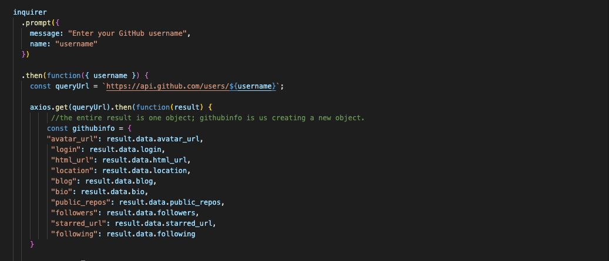
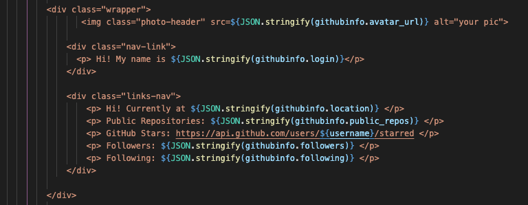
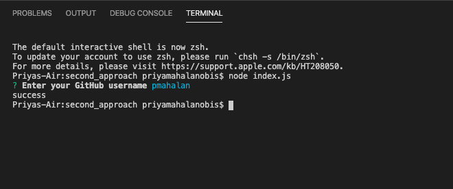

# Node + GitHub API CLI Application

### GH Pages URL: https://pmahalan.github.io/Node.js-Generator/

My purpose in building this application was to practice utilizing node modules, including inquirer and electron. (Additionally, through this application, I used AJAX calls and referenced the information contained in an API.) Upon typing in the command "node index.js" into the terminal while in this application's directory, the user is asked (via the 'inquirer' node package) what their GitHub username is. Then, that username is fed into a URL which is used in an AJAX call to the GitHub API. I wrote code which references specific values within that API, such as followers, following, location, and number of public repositories. In addition to retrieving these values for any given username fed to the AJAX URL, my command-line application generates an HTML file upon the entering of the username to the command line. (That HTML file is a webpage which displays the information of the GitHub user whose username was typed into the command line.)

One aspect of functionality which was difficult to achieve -- but which I was finally successful in implementing -- is the utilization of a multiple-choice "checkbox" question in inquirer. The checkbox question asks the user which of four colors they like the best, then dynamically uses their answer to determine the color of some of the CSS aspects generated in the HTML page. (Prior to this working successfully, I had hard-coded those CSS aspects to be a single color, such as green.)

Another aspect of functionality which was difficult but which I finally got to work properly is the conversion of the generated HTML page to a PDF document. I accomplished this through the use of the node package "electron-HTML-to"; however, I needed to downgrade the version of that package (as well as "electron") in my package.json file in order for this to successfully take place.

